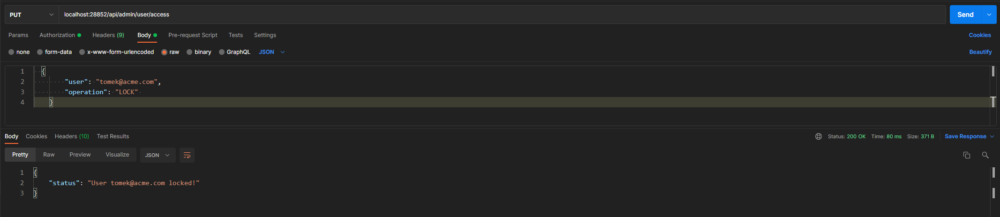

# Account_Service Rest App
Restful Api Account_Service - JetBrains Academy Project.

## About
Application that uses the basics of user authentication and authorization, know how to register security events, and get acquainted with various requirements, 
such as modern information security standards for web applications. Logging in console and persistance events in database.

## Tech
- Java
- Spring Framework
- Spring Security
- Hibernate
- H2 Database
- Json
- Lombok

## Illustrations

### Register user

### Change role by admin

### Get all users by admin

### Change access status by admin

### Show all events by auditor

### Post payments by accountant

